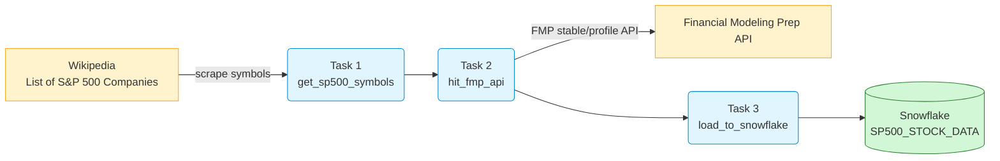
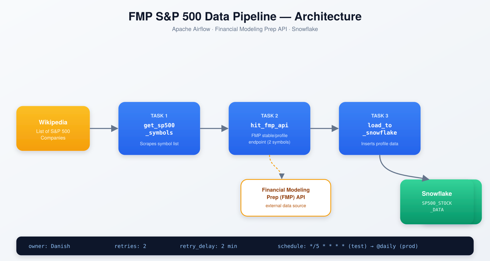
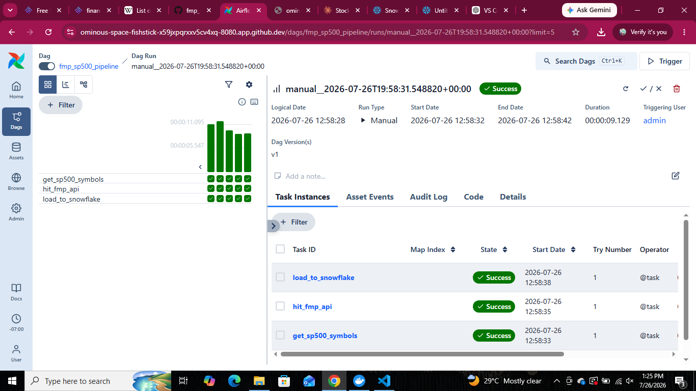
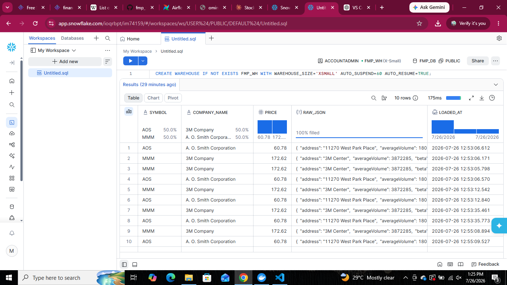

# FMP S&P 500 Data Pipeline (Apache Airflow + Snowflake)

An Apache Airflow DAG that automatically pulls S&P 500 company data from the
[Financial Modeling Prep (FMP)](https://financialmodelingprep.com/) API and
loads it into a Snowflake data warehouse for analysis.

---

## 📌 Overview

| | |
|---|---|
| **Orchestrator** | Apache Airflow (TaskFlow API) |
| **Data Source** | Wikipedia (S&P 500 symbol list) + FMP API |
| **Warehouse** | Snowflake |
| **Owner** | Muhammad Danish |
| **Schedule** | Every 5 minutes (testing) → `@daily` (production) |
| **Retries** | 2, with a 2-minute delay between attempts |

---

## 🏗️ Architecture



**Flow:**
1. **`get_sp500_symbols`** — scrapes the current S&P 500 constituent list from Wikipedia.
2. **`hit_fmp_api`** — calls the FMP `stable/profile` endpoint for each symbol to fetch company profile data.
3. **`load_to_snowflake`** — inserts the profile data into a Snowflake table, storing the full API response as a `VARIANT` (JSON) column alongside key structured fields.

### Original design sketch


---

## 🗂️ Project Structure

```
FMP_Project/
├── dags/
│   └── fmp_sp500_pipeline_dag.py   # Main Airflow DAG
├── assets/                          # Diagrams & screenshots
├── requirements.txt
└── README.md
```

---

## ⚙️ DAG Configuration

| Setting | Value |
|---|---|
| `dag_id` | `fmp_sp500_pipeline` |
| `schedule` | `*/5 * * * *` (testing) |
| `owner` | Danish |
| `retries` | 2 |
| `retry_delay` | 2 minutes |
| `catchup` | False |

---

## 🚀 Setup & Run (GitHub Codespaces)

### 1. Clone / open in Codespaces
Open this repository → **Code → Codespaces → Create codespace on main**.

### 2. Create a virtual environment & install dependencies
```bash
python3 -m venv venv
source venv/bin/activate
pip install -r requirements.txt
```

### 3. Configure Airflow
```bash
export AIRFLOW_HOME=$(pwd)/airflow_home
export AIRFLOW__CORE__DAGS_FOLDER=$(pwd)/dags
airflow standalone
```
Note the auto-generated `admin` password printed in the terminal (or check
`airflow_home/simple_auth_manager_passwords.json.generated`).

### 4. Forward port 8080
Codespaces auto-detects port `8080` — open it from the **Ports** tab and log
in with the `admin` credentials above.

### 5. Set the FMP API key
```bash
airflow variables set fmp_api_key <YOUR_FMP_API_KEY>
```

### 6. Add a Snowflake connection
In the Airflow UI: **Admin → Connections → +**

| Field | Value |
|---|---|
| Connection Id | `snowflake_default` |
| Connection Type | Snowflake |
| Login | your Snowflake username |
| Password | your Snowflake password |
| Schema | `PUBLIC` |
| Account | `<account_locator>-<region_id>` (e.g. `abcd123-us-east1`) |
| Warehouse | `FMP_WH` |
| Database | `FMP_DB` |
| Role | `ACCOUNTADMIN` |

### 7. Create the Snowflake objects
```sql
CREATE WAREHOUSE IF NOT EXISTS FMP_WH WITH WAREHOUSE_SIZE='XSMALL' AUTO_SUSPEND=60 AUTO_RESUME=TRUE;
CREATE DATABASE IF NOT EXISTS FMP_DB;
CREATE SCHEMA IF NOT EXISTS FMP_DB.PUBLIC;
CREATE TABLE IF NOT EXISTS FMP_DB.PUBLIC.SP500_STOCK_DATA (
    symbol STRING,
    company_name STRING,
    price FLOAT,
    raw_json VARIANT,
    loaded_at TIMESTAMP
);
```

### 8. Trigger the DAG
In the Airflow UI, toggle `fmp_sp500_pipeline` **ON** and hit **Trigger**.

---

## 📸 Screenshots

**All three tasks passing:**


**Data loaded into Snowflake:**


---

## 🔮 Future Improvements
- Save raw symbol list to **S3** as a backup/staging layer before hitting the API (originally scoped, deferred for v1).
- Remove the 2-symbol test limit and process the full S&P 500 list.
- Switch `schedule` to `@daily` for production use.
- Add deduplication logic (`MERGE` instead of plain `INSERT`) to avoid duplicate rows on repeated runs.

---

## 👤 Author
**Muhammad Danish** — BS Computer Science, SMIT, Karachi
